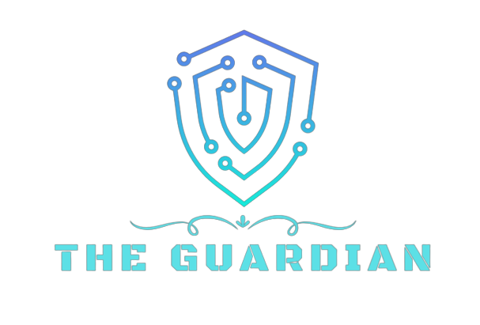

 

    
   

 

# The-Guardian-Server

The server side is built in Node.js and Express.js and used all sorts of advanced API's and libs. It's first module connects to Instagram's database via aouth, and with the user's consent, gets their posts. After the information is acquired, the different parts are being parsed: The text is sent to Google API to detect locations based on context. The images are being used in three modules: 1.Close cycle - this module uses faces API and recognition to detect faces, harvest them from the images, and based on key features compare and count who are the people that appeared the most in the user's posts. 2. Label detection- using Google Image detection API and personally built module to download and send the images (to properly accept an answer) we obtain the objects and general labels from each photograph, govong us a more specific, yet still general, understanding of the user's interests. 3.Semantic connections- using Natural.js and a callassifier we trained ourselves, we strove to to learn more in order to protect our users, so we classified the different labels into categories that would light a red light and help iur users understand how exposed they are.
